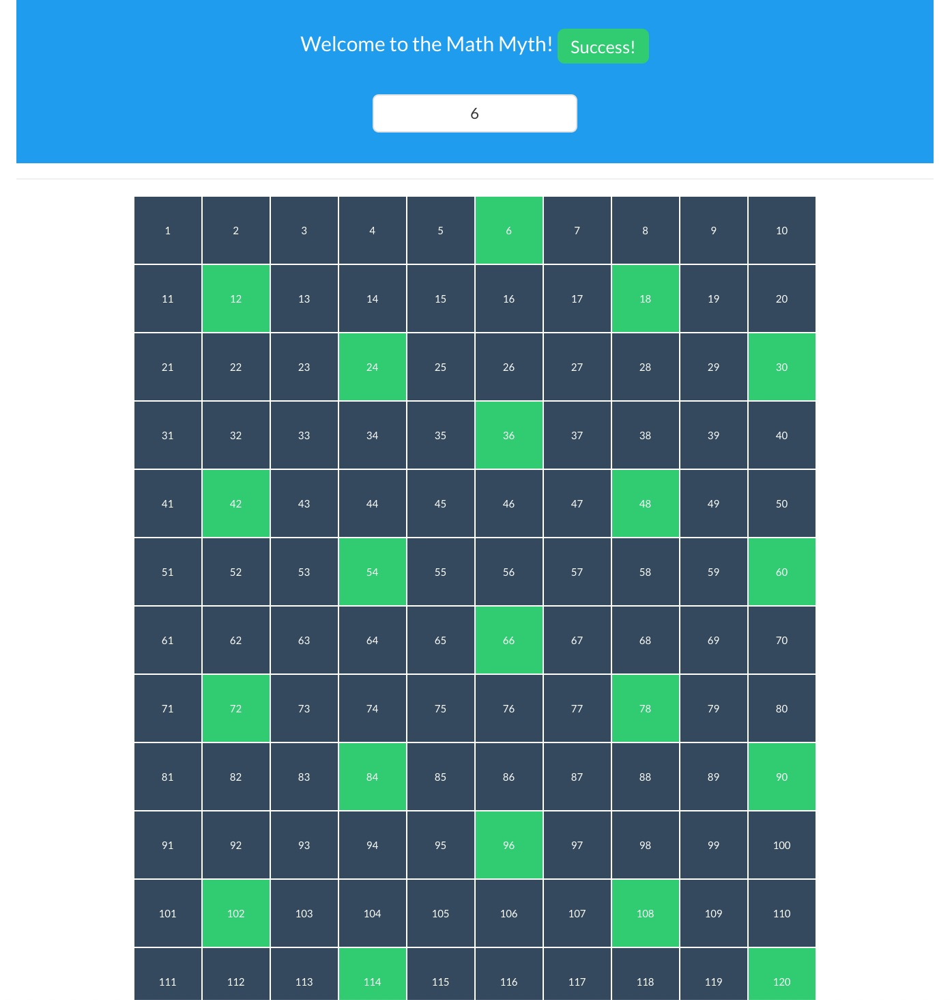

# Princess

This is a toy to play with [drab](https://tg.pl/drab). The code is inspired by my wife - she drew a 10x10 table to show the magic of dividend to my 6-year-old girl.

## Running

To start your Phoenix server:

  * Install dependencies with `mix deps.get`
  * Install Node.js dependencies with `cd assets && npm install`
  * Start Phoenix endpoint with `mix phx.server`

Now you can visit [`localhost:4000`](http://localhost:4000) from your browser.
